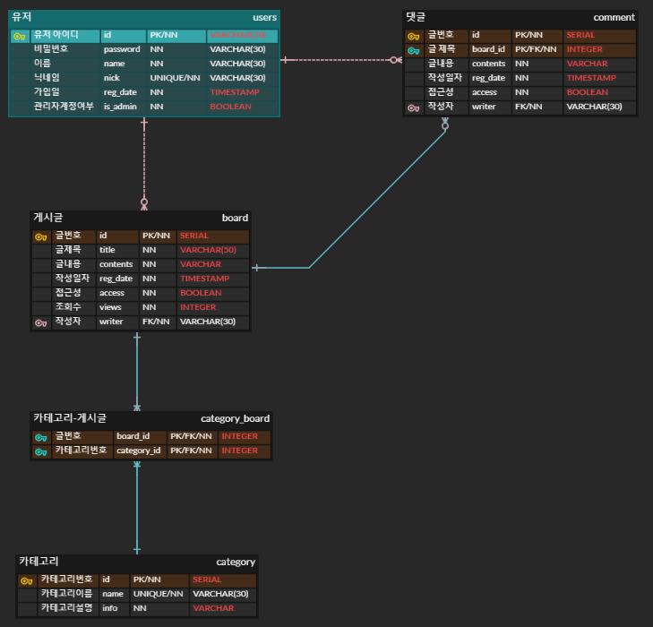

# spring-practice-project

**개요**

이 프로젝트는 **초보 웹 개발자를 위한 스프링 5 프로그래밍 입문 책**을 통해 학습한 내용을 기반으로 만든 프로젝트 입니다.

카테고리별로 개념을 정리할 수 있는 커뮤니티 사이트를 주제로 만든 것이며, 개발하면서 추가적으로 공부한 내용에 대해 정리해 나갈 것입니다.

**카테고리에 따른 개념을 정리할 수 있는 기능을 정리할 수 있도록 한다.**

### 요구사항

#### 회원

- 회원은 가입을 하기 위해 아이디, 비밀번호, 이름, 닉네임을 입력해야 한다.
- 가입한 회원은 관심은 카테고리를 지정할 수 있다.
- 회원은 아이디로 식별한다.

#### 게시글

- 회원은 게시글을 여러 개 작성할 수 있고 게시글 하나는 한 명의 회원만 작성할 수 있다.
- 게시글에 대한 글번호, 글제목, 글내용, 작성자, 카테고리 정보, 접근성을 유지해야 한다.
- 게시글은 글번호와 글제목으로 식별한다.

#### 댓글

- 회원은 여러 개의 댓글을 작성할 수 있고 게시글 하나에 여러 개의 댓글을 작성할 수 있다.
- 댓글에 대한 글번호, 글내용, 작성일자, 작성된 게시글, 접근성, 작성자 정보를 유지해야 한다.
- 댓글은 글번호와 작성된 게시글로 식별한다.

#### 카테고리

- 카테고리는 카테고리 번호, 카테고리 이름과 정보를 가진다.
- 카테고리는 카테고리 번호와 이름으로 식별한다.

### Entity-Relation Diagram

## 상세 기능

### 회원

- [x] 회원 가입

  Request-URL : `POST /users`

- [x] 개인 정보 조회

  Request-URL : `GET /users/{id}`
  
  
  
- [x] 사용자 정보 수정

  Request-URL : `PATCH /users/{id}`
  
  
  
- [x] 사용자 삭제

  Request-URL : `DELETE /users/{id}`

- [x] 로그인

  Request-URL : `POST /login`

- [x] 로그아웃

  Request-URL : `GET /logout`

### 게시글

- [x] 게시글 작성

  Request-URL : `POST /board`

  

- [x] 게시글 조회

  Request-URL : `GET /board/{id}`

- [x] 게시글 수정

  Request-URL : `PATCH /board/{id}`

- [x] 게시글 삭제

  Request-URL : `DELETE /board/{id}`

  

### 댓글

- [x] 댓글 작성

  Request-URL : `POST /board/{board_id}/comment`

  

- [x] 댓글 수정

  Request-URL : `PATCH /board/{board_id}/comment/{comment_id}`

  

- [x] 댓글 삭제

  Request-URL : `DELETE /board/{board_id}/comment/{comment_id}`

### 카테고리

- [x] 카테고리 추가

  Request-URL : `POST /category`
  
  
  
- [x] 카테고리 조회

  Request-URL : `GET /category/{id}`

  

  - [x] 카테고리 ID로 게시글 검색

    Request-URL : `GET /category/{id}/board`

    

- [x] 카테고리 수정

  Request-URL : `PATCH /category/{id}`